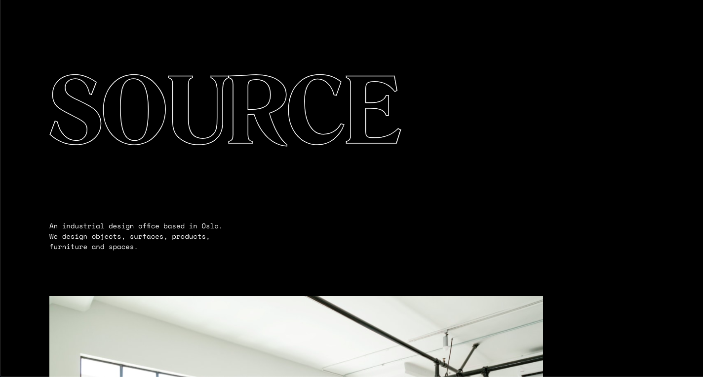
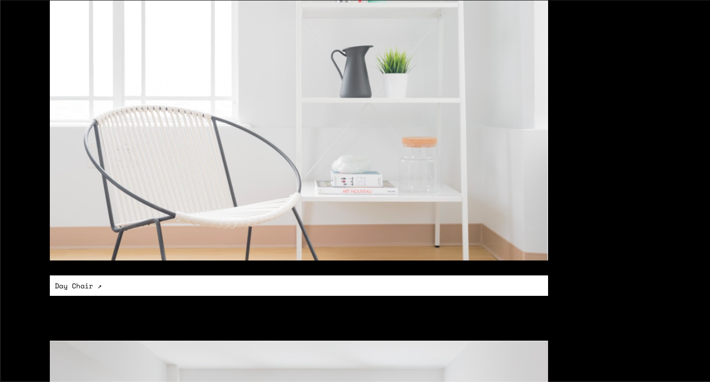
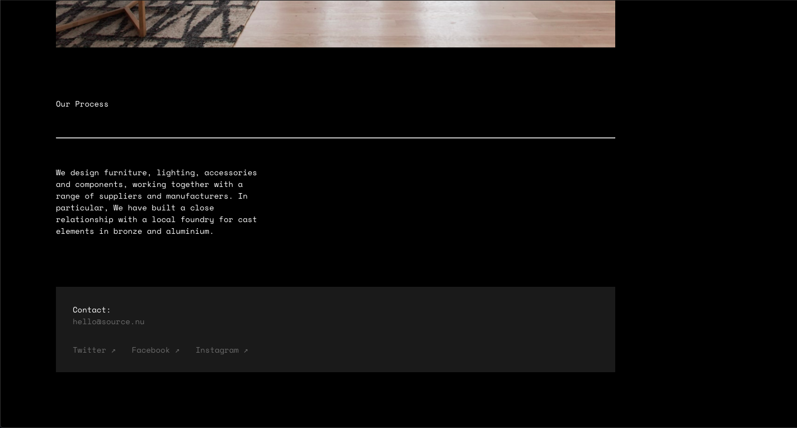

# Source
Responsive single column site for a design studio.

## Table of contents
* [General info](#general-info)
* [Screenshots](#screenshots)
* [Technologies](#technologies)
* [Demo](#demo)
* [Features](#features)
* [Status](#status)
* [Inspiration](#inspiration)
* [Contact](#contact)

## General info
This was the second homework project on the [Superhi Foundation](https://superhi.com/courses/html-css-javascript-foundation) course. The project is based on the main project of the week, [Patio](https://github.com/guybroadhurst/patio), but redesigned by Matt Vernon for a fictional design studio.

## Screenshots

## Technologies
* HTML5
* CSS3

## Demo
[Live Demo](https://guybroadhurst.github.io/source/)

## Features
List of features:
* Single column design.
* Responsive to smaller screen sizes.

## Status
Project is: _finished_ and complete for the course

## Inspiration
Designed by Matt Vernon, [Website](http://matthewvernon.co/) [Twitter](https://twitter.com/dApp_boi)
 
## Contact
Created by [@guybroadhurst](https://www.guybroadhurst.co.uk/) - feel free to contact me!